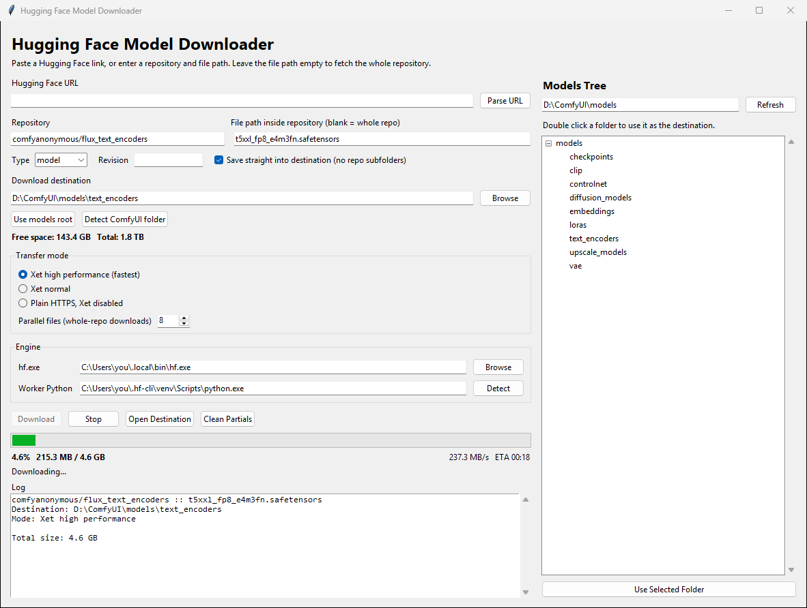

# Hugging Face Model Downloader

A small desktop app for pulling large models off the Hugging Face Hub, with a real
progress bar, live transfer speed and an ETA. Built for dropping checkpoints into
ComfyUI model folders, but it works for any repo or file.




## Why

The `hf` command line tool switches to a machine-readable output mode as soon as its
output is piped, so a GUI wrapped around it sees exactly one line — the final path —
after the whole transfer finishes. On a 40 GB checkpoint that means an hour of a
window that looks frozen.

This app runs the transfer through `huggingface_hub`'s own Python API in a worker
process and reads byte counts from its supported `tqdm_class` hook, so progress is
exact for both the Xet and the plain-HTTPS paths.

## Features

- **Xet high-performance transfers** — the fast path, on by default
- Real progress bar with live MB/s and ETA, taken from actual byte counts
- Paste any Hub URL, or enter `owner/name` plus a file path
- Whole-repo downloads with configurable parallelism
- Browse your ComfyUI models tree and pick a destination by double-clicking
- Saves files straight into the folder you chose, without recreating repo subfolders
- Clear errors for gated repos, private repos, wrong filenames and bad revisions
- Free-space check against the real file size before the transfer starts
- Stop button that actually kills the transfer, and cleans up the dead partial file

## Requirements

- Python 3.9+ with Tk (the standard `python.org` and Conda builds include it)
- The [`hf` CLI](https://huggingface.co/docs/huggingface_hub/guides/cli), or any
  Python environment with `huggingface_hub >= 0.30` and `hf_xet` installed

The app does not need to be installed into the same environment as
`huggingface_hub`. On launch it looks for a suitable interpreter and uses that one
for the transfer, so you can run the GUI from any Python you like.

If you have neither, install the CLI:

```bash
pip install -U "huggingface_hub[cli,hf_xet]"
```

## Usage

```bash
python hf_downloader.py
```

Or on Windows, double-click `run.bat`.

### Start menu, desktop and taskbar (Windows)

Double-click **`install_shortcut.bat`**. It adds *HF Model Downloader* to the Start
menu and the desktop with its own icon, launching without a console window. Then
open Start, right-click the entry and choose **Pin to taskbar**. (Windows does not
let programs pin themselves, so that last click is yours.)

The shortcut and the app share an AppUserModelID, so the running window stacks onto
the pinned icon instead of showing up as a second, generic Python button. Because
the shortcut points at this folder, re-run the installer if you move the checkout.

From PowerShell you can also pick the interpreter, or remove the shortcuts:

```powershell
.\create_shortcut.ps1 -Desktop -Python "C:\Python312\pythonw.exe"
.\create_shortcut.ps1 -Remove
```

1. Paste a Hugging Face file URL and press **Parse URL** — or type the repository and
   file path yourself. Leave the file path empty to fetch the whole repository.
2. Pick a destination, either by typing it, browsing, or double-clicking a folder in
   the models tree on the right.
3. Press **Download**.

For gated repositories, and for private ones, sign in first:

```bash
hf auth login
```

### Settings

The app remembers your last repository, destination, models folder and transfer mode
in a per-user settings file, so the checkout stays clean:

| Platform | Location |
| --- | --- |
| Windows | `%APPDATA%\hf-model-downloader\settings.json` |
| macOS | `~/Library/Application Support/hf-model-downloader/settings.json` |
| Linux | `~/.config/hf-model-downloader/settings.json` |

## A note on resuming

`huggingface_hub` writes each attempt to a process-unique `.incomplete` file opened
in truncate mode, so **an interrupted download cannot be resumed** — retrying starts
from zero. Every abandoned attempt would also leave its partial file behind forever,
which on a 40 GB model quietly eats a lot of disk.

This app handles the second half of that: it deletes its own partial when a transfer
is stopped or fails, reports any leftovers it finds in the destination, and gives you
a **Clean Partials** button to reclaim the space. The first half is a library
limitation and is not something the app can work around.

## Transfer modes

| Mode | When to use it |
| --- | --- |
| Xet high performance | Default. Fastest option for Xet-backed repos. |
| Xet normal | Xet without the high-performance flag. |
| Plain HTTPS, Xet disabled | Fallback when Xet misbehaves on your network. |

Xet deduplicates against a local chunk cache, so a repeat download of similar weights
can transfer noticeably fewer bytes than the file size. That cache is bounded and
evicts on its own.

## How it works

```
GUI process                      worker process
(any Python with Tk)             (Python that owns huggingface_hub + hf_xet)

  Download  ──── job as JSON ───▶  hf_hub_download / snapshot_download
                                     with tqdm_class=Reporting
  progress ◀─── JSON lines ──────  byte counts, errors, final path
```

The same file is both halves — `python hf_downloader.py --worker` runs worker mode,
reading a job from stdin and writing progress to stdout.

## Credits

By Matt Hallett.

No licence is granted for reuse or redistribution; all rights reserved.
